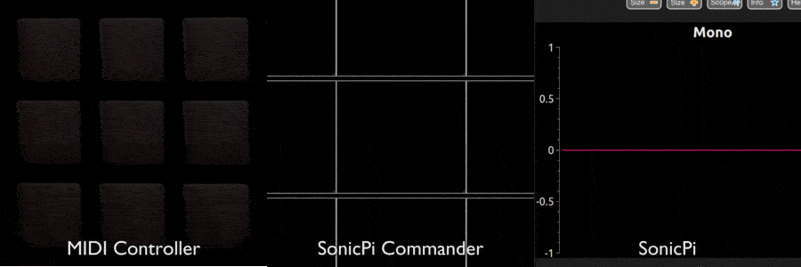
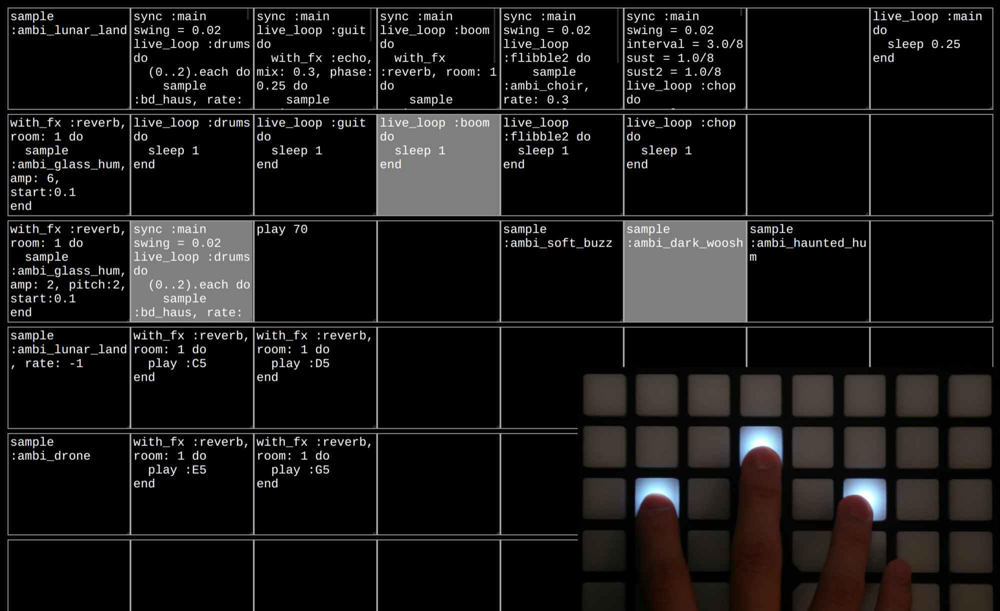

# SonicPi Commander

SonicPi Commander is a software bridge that executes [SonicPi](http://sonic-pi.net/) code snippets using a MIDI controller. Designed for a [Novation Launchpad](https://us.novationmusic.com/launch/launchpad), SonicPi Commander blurs the lines between livecoding, [controller scripting](https://rbnrpi.wordpress.com/2016/04/01/a-completely-different-way-to-use-sonic-pi-with-a-midi-controller/), and sampling.

[Watch the Video](https://www.youtube.com/watch?v=BRSSNtuW618)

The SonicPi Commander interface is largely unassuming, consisting of a grid of 8 x 8 freely editable text fields that mirror the Launchpad's layout. Pressing a pad on the Launchpad executes the code in the corresponding text field. With minimal code, one can easily program a pad to trigger notes, samples, chords, or even loops à la Ableton Live. However, why stop there? With the ability to edit code, practically any behavior can be created, not just those found in traditional music software. How about, say, playing a random chord when a pad is pressed? A sample that gets faster every time it is played? An effect switcher that cycles through effects? Why not program all of the above, in real time? SonicPi Commander is simultaneously an instrument and a blank canvas; it is up to the user to code, customize, and ultimately, perform.

---

## Behind the Scenes

SonicPi Commander's interface is written in HTML5. However, most of the work lies under the hood. Connecting the Launchpad to SonicPi Commander using WebMIDI was fairly straightforward. However, connecting SonicPi Commander to SonicPi through Open Sound Control involved digging my hands deep into both SonicPi and OSC. After getting things in shape, I ended up [contributing my fixes](https://github.com/samaaron/sonic-pi/commit/37e7876dc577dd3e70342ffd5e10c835ec4899d1) back into the SonicPi codebase.

---

Learning Focus: Livecoding, SonicPi, Open Sound Control

Media: Interactive Music System, Controller Interface

Software: Browser, SonicPi, HTML5, JavaScript, Ruby

Hardware: Novation Launchpad

Date: October 2016
